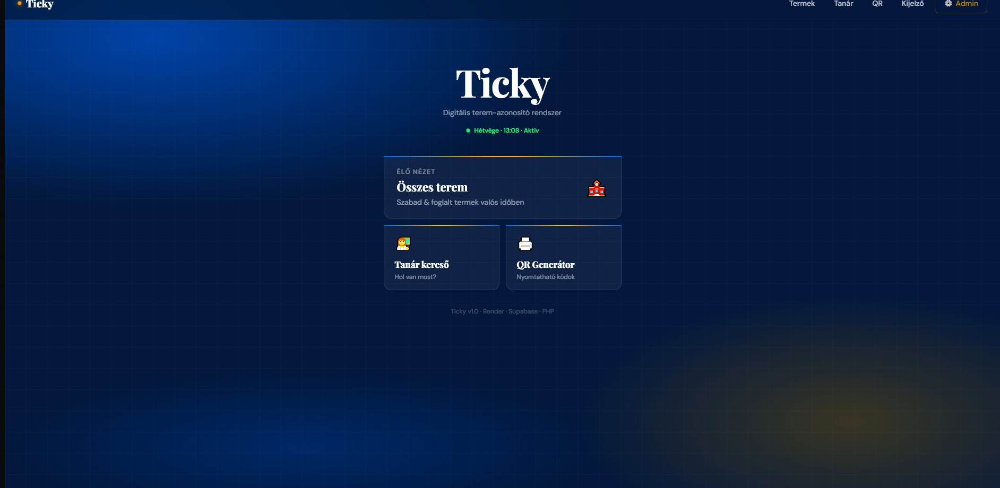
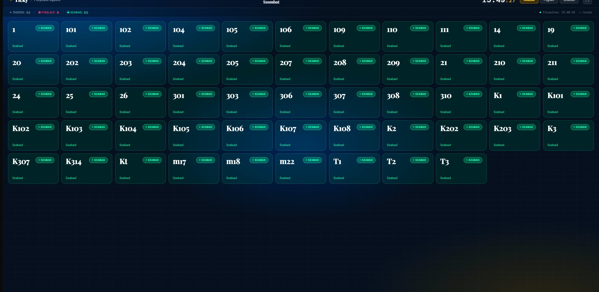
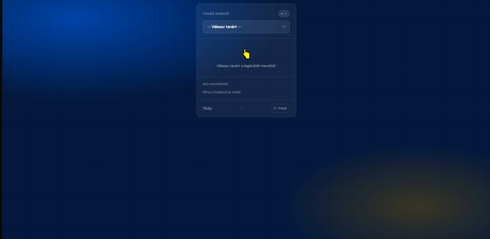
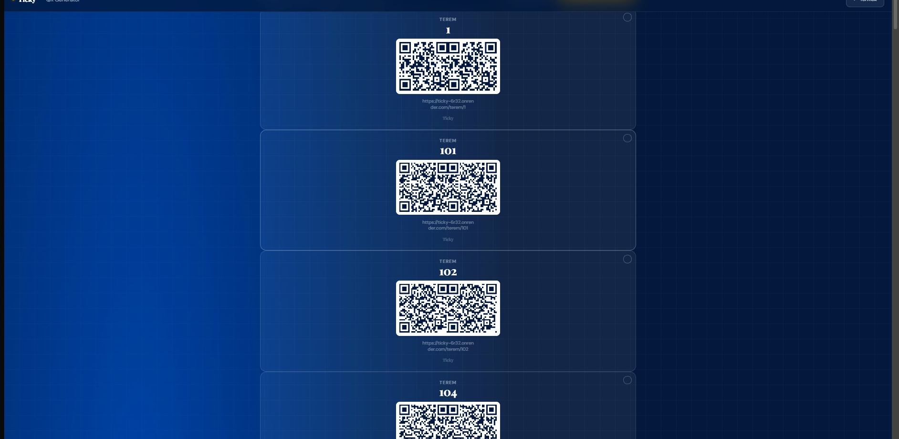

# 🏫 Ticky — Real-Time Classroom Availability System

[](https://ticky-6r32.onrender.com)
[](LICENSE)
[](https://php.net)
[](https://supabase.com)

> QR code-based classroom identification system built as a thesis project — deployed and running live at school, tracking **53 rooms** and **69 teachers** in real time.

---

## 📸 Screenshots

### Home Page


### Live Room Dashboard — Corridor Display


### Teacher Finder


### QR Code Generator


---

## ✨ Features

- 🟢 **Real-time room status** — see which rooms are free or occupied right now
- 👩‍🏫 **Teacher finder** — search any of the 69 teachers and see where they are
- 📺 **Corridor display mode** — full-screen TV/tablet view for hallway screens
- 🖨️ **QR code generator** — generate & print QR codes for every classroom
- 📅 **Weekly timetable** — per-room and per-teacher schedule view
- 🔐 **Admin panel** — password-protected dashboard for managing teachers and rooms
- ⚡ **Auto-refresh** — data updates every 30–60 seconds without page reload

---

## 🛠️ Stack

| Layer | Technology |
|-------|-----------|
| Backend API | PHP 8.x (Render.com) |
| Database | Supabase (PostgreSQL) |
| Frontend | Tailwind CSS + Vanilla JS |
| Importer | Node.js (run locally) |
| Deploy | Render.com |

---

## 📡 API Endpoints

| Endpoint | Description |
|----------|-------------|
| `GET /api/ping` | Health check |
| `GET /api/termek` | All rooms |
| `GET /api/termek?allapot=1` | Rooms with live availability status |
| `GET /api/terem/{number}` | Current & next class for a room |
| `GET /api/napirend/{number}` | Today's schedule for a room |
| `GET /api/napirend/{number}?nap=heten` | Full weekly schedule for a room |
| `GET /api/tanarok` | All teacher codes and names |
| `GET /api/tanar/{code}/orarend` | Today's schedule for a teacher |

---

## 📄 Example Response

```json
GET /api/terem/204
{
  "terem": "204",
  "allapot": "foglalt",
  "aktualis": {
    "tanar": "ÁSZJ",
    "tanar_nev": "Ácsné Szűcs Judit",
    "osztaly": "9.b",
    "tantargy": "mny",
    "kezdes": "09:15",
    "vegzes": "10:00",
    "perc_maradt": 23
  },
  "kovetkezo": {
    "tanar": "ÁSZJ",
    "osztaly": "10.c",
    "kezdes": "10:15",
    "vegzes": "11:00"
  }
}
```

---

## 🗂️ File Structure

```text
ticky-backend/
├── index.php              ← Router
├── config/
│   └── supabase.php       ← Supabase connection
├── utils/
│   └── helpers.php        ← Routing, CORS, JSON helpers
├── api/
│   ├── terem.php
│   ├── termek.php
│   ├── napirend.php
│   ├── tanarok.php
│   ├── tanar_orarend.php
│   ├── admin_tanar.php
│   └── admin_terem.php
└── pages/
    ├── terem.php          ← /terem/{number}
    ├── termek.php         ← /termek
    ├── napirend.php       ← /terem/{number}/nap
    ├── tanar.php          ← /tanar
    ├── kijelzo.php        ← /kijelzo
    ├── qr.php             ← /qr
    └── admin.php          ← /admin
```

---

## 🚀 Deployment (Render.com)

1. Push `ticky-backend/` to GitHub
2. Render → **New Web Service** → Connect repo
3. **Build command:** `echo "No build needed"`
4. **Start command:** `php -S 0.0.0.0:$PORT index.php`
5. Set environment variables (see below)
6. Deploy — takes ~1–2 minutes

### Required Environment Variables

| Variable | Description |
|----------|-------------|
| `SUPABASE_URL` | Your Supabase project URL |
| `SUPABASE_ANON_KEY` | Public anon key |
| `SUPABASE_SERVICE_KEY` | Service role key (admin ops) |
| `TIMEZONE` | `Europe/Budapest` |
| `ADMIN_PASSWORD` | Admin panel password |
| `ADMIN_ALLOWED_IPS` | Comma-separated allowlist for admin access, e.g. `84.2.3.4,84.2.3.0/24` |

> ⚠️ **Never commit these keys.** Set them via Render dashboard → Environment Variables.

---

## 📥 Timetable Importer (Node.js)

```bash
cd importer
npm install
node importer.js
```

Requires a `.env` file with `SUPABASE_URL` and `SUPABASE_SERVICE_KEY`.
The importer wipes existing data and re-uploads. Run it whenever the timetable changes.

---

## 🗃️ Database Schema

| Table | Fields |
|-------|--------|
| `termek` | `terem_szam`, `emelet` |
| `tanarok` | `rovid_nev`, `nev` |
| `orarendek` | `terem_id`, `tanar_id`, `osztaly`, `tantargy`, `het_napja`, `kezdes`, `vegzes` |

`het_napja`: `1` = Monday … `5` = Friday

---

## 🔔 Bell Schedule

| Period | Start | End |
|--------|-------|-----|
| 1st | 07:30 | 08:10 |
| 2nd | 08:20 | 09:05 |
| 3rd | 09:15 | 10:00 |
| 4th | 10:15 | 11:00 |
| 5th | 11:10 | 11:55 |
| 6th | 12:05 | 12:50 |
| 7th | 12:50 | 13:35 |
| 8th | 13:40 | 14:20 |

---

## 🤝 Contributing

1. **Fork** the repository
2. **Clone** your fork: `git clone https://github.com/your-username/Ticky.git`
3. **Create a branch**: `git checkout -b feature/your-feature`
4. **Commit**: `git commit -m "Add your feature"`
5. **Push**: `git push origin feature/your-feature`
6. **Open a Pull Request**

Please open an **Issue** first for major changes.

---

## 📄 License

This project is licensed under the [MIT License](LICENSE).

---

<p align="center">Built with ☕ by <a href="https://github.com/Davedka">Davedka</a></p>
