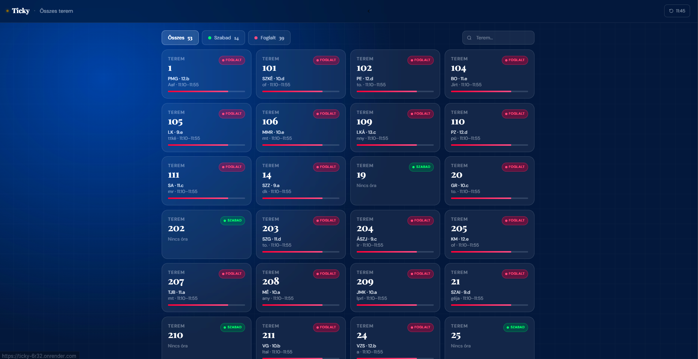
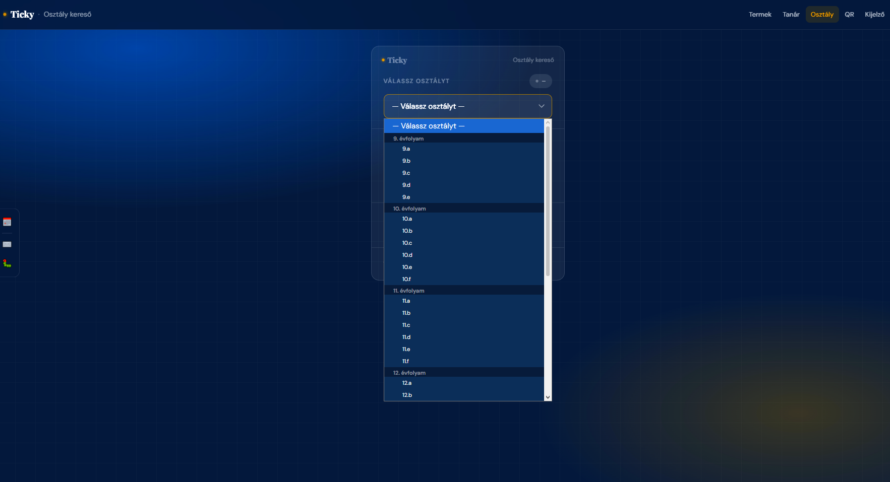
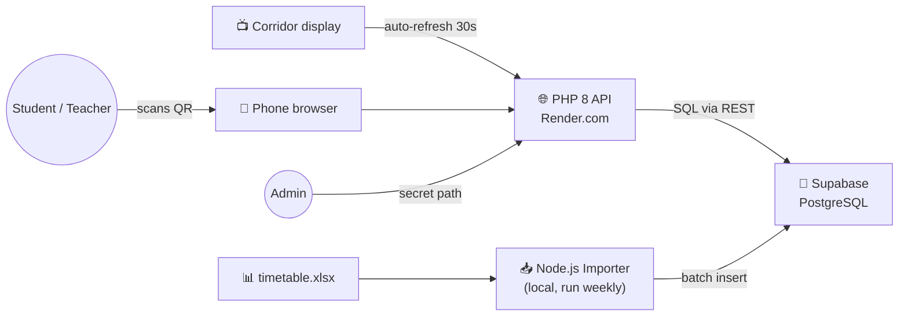

div align="center">
# 🏫 Ticky
 
### Real-Time Classroom Availability System
 
[](https://ticky-6r32.onrender.com)
[](https://php.net)
[](https://supabase.com)
[](LICENSE)
 
QR-code-based classroom identification and live timetable system.
Deployed and running at school — tracking **53 rooms**, **69 teachers**, and a full weekly schedule in real time.
 
[Live demo](https://ticky-6r32.onrender.com) · [Report a bug](https://github.com/Davedka/Ticky/issues) · [Request a feature](https://github.com/Davedka/Ticky/issues)
 
</div>
---
 
## 📋 Table of contents
 
- [What it does](#-what-it-does)
- [Screenshots & pages](#-screenshots--pages)
- [Architecture](#-architecture)
- [Tech stack](#-tech-stack)
- [API reference](#-api-reference)
- [Database schema](#-database-schema)
- [Project structure](#-project-structure)
- [Local development](#-local-development)
- [Deployment](#-deployment-rendercom)
- [How I built this](#-how-i-built-this)
- [AI-assisted development](#-ai-assisted-development)
- [Roadmap](#-roadmap)
---
 
## ✨ What it does
 
In a normal school day you walk a corridor and the only way to know what's happening in a room is to peek through the door. Ticky replaces that with a small piece of paper next to the door: a **QR code**. You scan it, and within a second you see:
 
- which class is in there right now
- which teacher is teaching
- what subject
- when the lesson ends
- what comes next
The same data also powers a **hallway display** (a TV in the corridor), a **teacher finder** (where is teacher X right now?), a **class finder** (where is class 10.b right now?), and a **printable QR sheet** for the caretaker to put up new rooms.
 
The whole thing runs on a free Render dyno + Supabase free tier, costs €0/month, and serves the entire school.
 
---
 
## 📸 Screenshots & pages
 
### 🏠 Home — the landing page
 
A minimal entry point. Shows the day, current time, system status, and four cards that go to the main views.
 

 
### 🗂️ Rooms — live grid
 
All **53 rooms** at once, color-coded by status: green = free, red = occupied. Each card shows the current teacher (short code), the class in there, and a thin progress bar for the remaining lesson time. Filters at the top (`Összes` / `Szabad` / `Foglalt`) and a search box.
 

 
### 👩‍🏫 Teacher finder
 
Pick any of the 69 teachers from a searchable dropdown and the page shows where they are right now (or that they currently have a free hour).
 

 
### 🎓 Class finder
 
Same idea, but for classes. Grouped by grade (9.→13.), so a student can find their own classroom in two taps.
 

 
### 📱 QR generator
 
Prints a QR code per room linking to `https://ticky-6r32.onrender.com/terem/{room_number}`. Multi-select + “print all” for batch printing.
 

 
### 🔐 Admin dashboard
 
Hidden route (path stored in `ADMIN_PATH` env var, not in the codebase). Live counters for rooms, teachers, users, breaks, plus a status panel with checks for: Supabase auth, API reachability, occupied/free split, admin path validity.
 

 
---
 
## 🏗️ Architecture
 

 
Two flows:
 
- **Read path** (every classroom visitor): browser → PHP API on Render → Supabase REST → PostgreSQL. Sub-200 ms typical response, cached for 30 s.
- **Write path** (once per week, manual): the school updates an Excel timetable → I run the Node.js importer locally → it wipes the `orarendek` table and re-inserts everything in batched transactions.
I deliberately kept the write path offline. Schools don't change timetables hourly, and pushing this to a hosted cron job was unnecessary complexity for the actual usage pattern.
 
---
 
## 🛠️ Tech stack
 
| Layer | Tech | Why |
|---|---|---|
| Backend API | **PHP 8.x** | Zero-config on Render (`php -S` start command), familiar from school |
| Database | **Supabase (PostgreSQL)** | Free tier, REST out of the box, auth built in for the admin panel |
| Frontend | **Tailwind CSS + Vanilla JS** | No build step, fast iteration, easy to deploy |
| Importer | **Node.js** | `xlsx` package handles Excel cleanly, easier than PHP for this |
| Hosting | **Render.com** | Free tier auto-deploys from GitHub |
| Misc | Docker (local dev), Git/GitHub PRs | |
 
---
 
## 📡 API reference
 
All endpoints return JSON, CORS-enabled, no auth required (admin endpoints are scoped under `ADMIN_PATH`).
 
| Method | Endpoint | Description |
|--------|----------|-------------|
| `GET` | `/api/ping` | Health check |
| `GET` | `/api/termek` | All rooms |
| `GET` | `/api/termek?allapot=1` | All rooms **with live status** |
| `GET` | `/api/terem/{number}` | Current & next class for a room |
| `GET` | `/api/napirend/{number}` | Today's schedule for a room |
| `GET` | `/api/napirend/{number}?nap=heten` | Full weekly schedule for a room |
| `GET` | `/api/tanarok` | All teacher codes & names |
| `GET` | `/api/tanar/{code}/orarend` | Today's schedule for a teacher |
 
### Example response
 
```http
GET /api/terem/204
```
```json
{
  "terem": "204",
  "allapot": "foglalt",
  "aktualis": {
    "tanar": "ÁSZJ",
    "tanar_nev": "Ácsné Szűcs Judit",
    "osztaly": "9.b",
    "tantargy": "mny",
    "kezdes": "09:15",
    "vegzes": "10:00",
    "perc_maradt": 23
  },
  "kovetkezo": {
    "tanar": "ÁSZJ",
    "osztaly": "10.c",
    "kezdes": "10:15",
    "vegzes": "11:00"
  }
}
```
 
---
 
## 🗃️ Database schema
 
| Table | Fields |
|-------|--------|
| `termek` | `terem_szam`, `emelet` |
| `tanarok` | `rovid_nev`, `nev` |
| `orarendek` | `terem_id`, `tanar_id`, `osztaly`, `tantargy`, `het_napja`, `kezdes`, `vegzes` |
 
`het_napja`: `1` = Monday … `5` = Friday
 
### Bell schedule
 
| Period | Start | End |
|---|---|---|
| 1st | 07:30 | 08:10 |
| 2nd | 08:20 | 09:05 |
| 3rd | 09:15 | 10:00 |
| 4th | 10:15 | 11:00 |
| 5th | 11:10 | 11:55 |
| 6th | 12:05 | 12:50 |
| 7th | 12:55 | 13:35 |
| 8th | 13:40 | 14:20 |
 
---
 
## 🗂️ Project structure
 
```text
ticky/
├── backend/
│   ├── index.php              ← Front controller / router
│   ├── config/
│   │   └── supabase.php       ← Supabase connection
│   ├── utils/
│   │   └── helpers.php        ← Routing, CORS, JSON helpers
│   ├── api/                   ← JSON endpoints
│   │   ├── terem.php
│   │   ├── termek.php
│   │   ├── napirend.php
│   │   ├── tanarok.php
│   │   ├── tanar_orarend.php
│   │   ├── admin_tanar.php
│   │   └── admin_terem.php
│   └── pages/                 ← HTML pages
│       ├── terem.php          ← /terem/{number}
│       ├── termek.php         ← /termek
│       ├── napirend.php       ← /terem/{number}/nap
│       ├── tanar.php          ← /tanar
│       ├── osztaly.php        ← /osztaly
│       ├── kijelzo.php        ← /kijelzo
│       ├── qr.php             ← /qr
│       └── admin.php          ← (hidden, ADMIN_PATH)
├── frontend/                  ← Tailwind sources, assets
├── importer/                  ← Node.js timetable importer
│   ├── importer.js
│   └── package.json
└── adatbazis/                 ← SQL schema + seed scripts
```
 
---
 
## 💻 Local development
 
### Prerequisites
- PHP **8.1+** (`php -v` to check)
- Node.js **18+** (only needed if you want to run the importer)
- A Supabase project ([create one free](https://supabase.com))
### Setup
 
```bash
# 1. Clone
git clone https://github.com/Davedka/Ticky.git
cd Ticky
 
# 2. Set up environment
cp .env.example .env
# → fill in SUPABASE_URL, SUPABASE_SERVICE_KEY, ADMIN_PATH
 
# 3. Create the schema
# Run adatbazis/schema.sql in the Supabase SQL editor
 
# 4. Start the PHP server
cd backend
php -S localhost:8000 index.php
```
 
Then open <http://localhost:8000>.
 
### Importing a timetable
 
```bash
cd importer
npm install
node importer.js ../path/to/timetable.xlsx
```
 
The importer wipes existing `orarendek` rows and re-uploads in batched transactions. Idempotent — safe to re-run.
 
### Environment variables
 
```env
SUPABASE_URL=https://xxxx.supabase.co
SUPABASE_SERVICE_KEY=eyJhbGc...        # service_role key, server-side only
ADMIN_PATH=/ticky-panel-7f3a9b2x       # any random string — your hidden admin URL
```
 
---
 
## 🚀 Deployment (Render.com)
 
1. Push to GitHub.
2. Render → **New Web Service** → connect this repo.
3. Build command: `echo "No build needed"`
4. Start command: `php -S 0.0.0.0:$PORT backend/index.php`
5. Add the environment variables above.
6. Deploy. First boot takes ~1–2 minutes.
The free dyno cold-starts in ~10 s after inactivity. For the corridor display, I keep a single uptime ping every 5 minutes so the screen never shows a cold start.
 
---
 
## 🧠 How I built this
 
A few decisions worth explaining, because they came up in the thesis defense:
 
**Why Supabase and not just PostgreSQL on Render?**
Render's free Postgres expires after 90 days. Supabase free is genuinely free indefinitely, and the row-level security + auth I get for the admin panel without writing code is a real win.
 
**Why PHP and not Node/Python?**
Render runs a PHP file with `php -S` as a one-liner start command — no build step, no Dockerfile, no framework setup. For an API this small, anything else would have been over-engineering. I'd probably pick Node + Express for a v2 if I add WebSocket-based live updates.
 
**Why "wipe and re-import" instead of diffing the timetable?**
The school's timetable changes a few times per semester at most, almost always as a full export from their scheduling software. Diffing two Excel files reliably is harder than re-importing in 4 seconds.
 
**Why a hidden URL instead of a login page for admin?**
Because the threat model is "a curious student typing `/admin` into the URL bar," not a real attacker. The hidden path is paired with Supabase auth — the path just keeps the panel out of search-engine crawls and casual exploration. A login page alone would be more visible without being more secure.
 
**What I'd do differently next time:**
- Add WebSocket / SSE updates instead of 30-second polling
- Write the backend in TypeScript with proper typed responses
- Add unit tests for the time-window logic from the start, not at the end
- Use a proper migration tool instead of one big `schema.sql`
---
 
## 🤖 AI-assisted development
 
I used AI tools throughout the project. Being honest about how is more useful than pretending I didn't.
 
**Tools used:** [Claude / ChatGPT / Copilot — *replace with the ones you actually used*]
 
**Where they helped:**
- Drafting the initial Supabase SQL schema (then reviewed and tightened by hand)
- Generating Tailwind boilerplate for the room cards
- Suggesting the structure for the time-window "what lesson is on now?" function
- Writing this README
**Where I had to override the AI:**
- The first version of the "current lesson" function it suggested didn't handle the gap between lessons correctly (it returned the *previous* lesson during break time). I caught it by manually testing at 10:05 (during a break) — wrote an explicit test case afterwards.
- It kept suggesting a JS frontend framework (React/Vue) when the project clearly didn't need one. I stuck with vanilla JS + Tailwind on purpose.
**My takeaway:** AI is a fast pair-programmer that doesn't get tired of boilerplate, but it confidently produces wrong code at the edges (time math, off-by-one errors, auth flow corners). Trust nothing without running it.
 
> *Note: replace the bracketed bits above with the real tools and the real mistakes you caught. Specificity is what makes this section believable.*
 
---
 
## 🗺️ Roadmap
 
- [ ] Unit tests for the time-window logic (PHPUnit)
- [ ] GitHub Actions CI: run tests on every push
- [ ] Server-Sent Events for live updates instead of polling
- [ ] Per-teacher weekly schedule view (currently only daily)
- [ ] Lyukasóra notifier (notify when a class has a free hour mid-day)
- [ ] Dark/light theme toggle
- [ ] i18n — English version of the UI for international visitors
---
 
<div align="center">
Built with ☕ by [**Dávid Kiss**](https://github.com/Davedka) · Mátészalka, HU
*Backend developer — looking for a junior role*
 
📧 dkiss0478@gmail.com · 🌐 [davedka.github.io/weboldal](https://davedka.github.io/weboldal)
 
</div>
 
